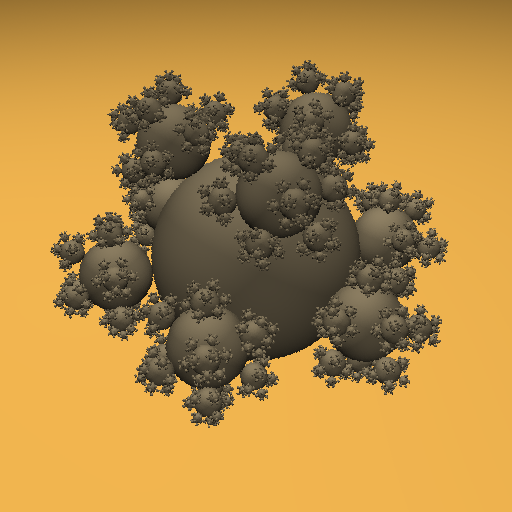

# Ray Tracer C++ Code for Prof James O'Brien
In this ray tracer code, I implemented the basic phong shading, reflection and BVH for acceleration.
Since it is actually my first time I have worked on such a big project, I often spent extra time figuring out one correct thing when all others went wrong. I am a high school student
so for many times I did not know what went wrong. I had to ask my friends for help as well as searched online for anything available. For example, I once had problem with triangle intersection.
All surfaces in the scene seemed to act the opposite, back being front, front being back. It took me almost 7 hours to simply discover my stupid mistake: I wrote minus instead of plus before
a virable. This is just one of those obstacles. Another I would like to mention is that I was meanwhile preparing for my ACT test, which came to an end on Sept 9. It was really hard but as well
fun to balance time for ACT exercise and for this ray tracer. I really appreciate TA Yiwen who provided me with a lot of useful information. I am just too shy to ask professor for help but
I have learnt a lot in his class, phong shading, BVH, etc. Also I need to give sincere thanks to my friend Zhanbo who helped me with many problems I had encountered.

Here are some demo pictures rendered by my ray tracer

I. Simple shell 

1) + Diffuse

2) + Specular -just slightly different from diffuse

3) + Ambient -hardly different from specular

4) + Shadow -add a little bit realistic

5) + Reflection -max bounces 5

II. A bunch of steel balls

1) + Diffuse

2) + Specular

3) + Ambient

4) + Shadow

5) + Reflection -max bounces 5

III. Glass balls above mounts to test refraction

1) + Diffuse

2) + Specular

3) + Ambient

4) + Shadow -maybe it's just hard shadow that looks weird

5) + reflection 

6) + Refraction -this looks weird as well

IV. Teapot 1 for less details rendering

V. Teapot 2 for more details rendering

VI. Teapot 3 for refraction test

## Acknowledgements

 - [BVH from my friend Zhanbo](https://github.com/skszb/TracerHW)
 - [AABB Intersection](https://www.scratchapixel.com/lessons/3d-basic-rendering/minimal-ray-tracer-rendering-simple-shapes/ray-box-intersection)
 - [Fresnel Equations](https://www.scratchapixel.com/lessons/3d-basic-rendering/introduction-to-shading/reflection-refraction-fresnel)
